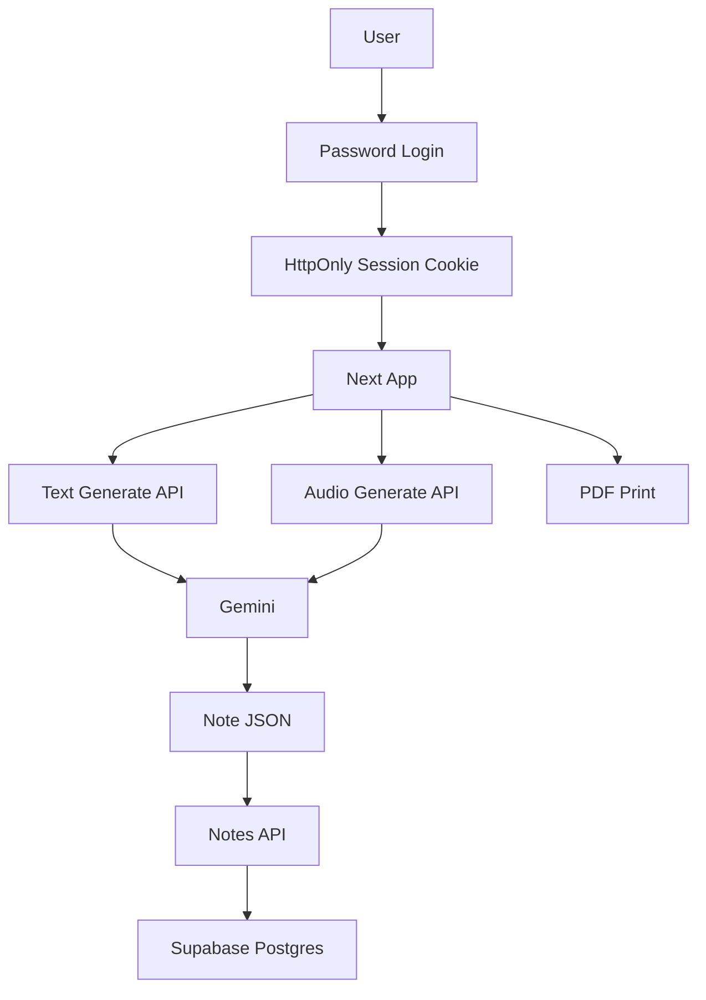

# PRD — finalstudy 실사용 웹

## 1. 개요
`finalstudy`를 개인용 실사용 웹으로 전환한다. 사용자는 강의 녹음본 또는 대본/텍스트를 넣고, AI가 구조화된 학습 노트를 만든다. 생성된 노트는 Supabase DB에 저장되고, 어디서든 다시 열 수 있으며, PDF로 내보낼 수 있다.

## 2. 해결할 문제
현재 MVP는 기능은 작동하지만 브라우저 로컬 저장 기반이다. 기기나 브라우저가 바뀌면 노트가 사라지고, 배포 앱으로 쓰기엔 접근 보호와 데이터 지속성이 부족하다.

해결할 문제:
- 노트가 localStorage에만 저장되어 실사용 안정성 낮음.
- 배포 시 URL을 아는 사람이 접근하면 Gemini 비용 노출 위험.
- 나중에 강의록 파일 + 녹음본 동기화 기능으로 확장할 DB 구조 필요.
- PDF 저장은 가능하나, 배포/환경변수/운영 절차가 정리되어 있지 않음.

## 3. 목표
- Vercel에 개인용 웹으로 배포 가능.
- 단일 앱 비밀번호로 접근 보호.
- 생성된 노트를 Supabase Postgres에 저장.
- 노트 목록, 열기, 제목 수정, 삭제를 서버 DB 기준으로 동작.
- 오디오/텍스트 입력 → AI 노트 생성 → DB 저장 → PDF 출력 흐름 유지.
- DB 스키마에 `owner_id`를 포함해 나중에 멀티유저 전환 가능.
- 강의록 파일/이미지 기능은 아직 구현하지 않되, 확장 테이블 설계 여지 확보.

## 4. 비목표
- 공개 SaaS 출시.
- 회원가입/멀티유저 UI.
- Supabase Auth, Google OAuth, 결제, 사용량 쿼터.
- 강의록 PDF/PPT/이미지 업로드 및 그림 삽입.
- 원본 오디오/대본 저장.
- 긴 오디오 chunking 처리.
- 모바일 앱.

## 5. 사용자 스토리

### US-1 · 비밀번호로 앱 보호
> 개인 사용자로서, 앱 접속 시 비밀번호를 입력하고 싶다. 왜냐하면 내 Gemini 비용과 노트를 다른 사람이 쓰거나 보는 것을 막고 싶기 때문이다.

완료 기준:
- 비밀번호 입력 전에는 노트 생성/목록 접근 불가.
- 인증 성공 시 HttpOnly 세션 쿠키 발급.
- 비밀번호는 `.env`의 `APP_PASSWORD`로 관리.

### US-2 · 어디서든 노트 재방문
> 학생으로서, 생성한 노트를 다른 브라우저에서도 다시 열고 싶다. 왜냐하면 시험 공부를 이어서 해야 하기 때문이다.

완료 기준:
- 노트는 Supabase `notes` 테이블에 저장.
- 앱 재접속 후 목록에서 노트를 다시 열 수 있음.
- 제목 수정/삭제가 DB에 반영됨.

### US-3 · 강의 입력 후 자동 저장
> 학생으로서, 녹음본 또는 대본으로 노트를 만들면 자동 저장되길 원한다. 왜냐하면 생성 직후 실수로 새로고침해도 결과를 잃고 싶지 않기 때문이다.

완료 기준:
- 텍스트 생성 API와 오디오 생성 API 모두 생성 완료 후 DB 저장.
- 생성 실패 시 DB에 불완전 노트 저장 X.
- 성공 시 목록 최신순 반영.

### US-4 · 구조화 학습 노트
> 학생으로서, 노트가 줄글 요약이 아니라 공부 가능한 구조이길 원한다. 왜냐하면 바로 암기와 복습에 쓰고 싶기 때문이다.

완료 기준:
- heading, paragraph, toggle, table, mermaid, examHint 유지.
- 전문 용어는 원어 중심 표기.
- 대단원/소단원 heading 번호 유지.
- PDF 출력 시 모든 toggle 펼침.

### US-5 · PDF 내보내기
> 학생으로서, 정리된 노트를 PDF로 저장하고 싶다. 왜냐하면 태블릿/노션/프린트 등으로 공부하고 싶기 때문이다.

완료 기준:
- PDF 저장 버튼 제공.
- 출력 시 업로드 UI, 사이드바, 버튼 제외.
- 닫힌 toggle도 모두 펼친 상태로 출력.

### US-6 · 향후 강의록+녹음본 확장
> 학생으로서, 나중에는 강의록 자료와 교수 녹음본을 함께 넣고 싶다. 왜냐하면 강의록의 공식 용어/그림/구조와 교수의 설명/출제 힌트를 합친 정리본이 필요하기 때문이다.

완료 기준:
- 이번 버전에서 실제 강의록 업로드는 구현하지 않음.
- DB에는 `owner_id`와 확장 후보 테이블 설계를 문서화.
- 나중에 `lecture_assets`로 강의록 파일, 오디오, transcript, 이미지 메타데이터 연결 가능.

## 6. 기술 스택
- Frontend/Backend: Next.js App Router + TypeScript
- UI: Tailwind CSS
- AI: Gemini API (`@google/genai`)
- DB: Supabase Postgres
- DB 접근: 서버 전용 Supabase Service Role
- 배포: Vercel
- 인증: 단일 앱 비밀번호 + HttpOnly 세션 쿠키
- 내보내기: Browser print → PDF 저장

## 7. 데이터 모델

### notes
```sql
create table notes (
  id uuid primary key,
  owner_id text not null default 'personal',
  title text not null,
  source_file_name text not null,
  note_json jsonb not null,
  created_at timestamptz not null default now(),
  updated_at timestamptz not null default now()
);

create index notes_owner_updated_idx on notes(owner_id, updated_at desc);
```

### 향후 확장 후보: lecture_assets
```sql
create table lecture_assets (
  id uuid primary key,
  owner_id text not null,
  note_id uuid references notes(id) on delete cascade,
  kind text not null,
  metadata jsonb not null default '{}',
  created_at timestamptz not null default now()
);
```

`kind` 예시:
- `lecture_file`
- `audio`
- `transcript`
- `slide_image`

## 8. 시스템 흐름


## 9. 환경변수
- `GEMINI_API_KEY`
- `APP_PASSWORD`
- `SESSION_SECRET`
- `SUPABASE_URL`
- `SUPABASE_SERVICE_ROLE_KEY`

## 10. 성공 기준
- Vercel 배포 URL에서 비밀번호 로그인 가능.
- 로그인 후 기존 MVP 기능 사용 가능.
- 생성한 노트가 Supabase에 저장됨.
- 새 브라우저/새로고침 후에도 노트 목록 복원.
- PDF 저장 시 노트 내용만 출력되고 모든 toggle 열림.
- `.env.example`과 배포 체크리스트로 재현 가능.
